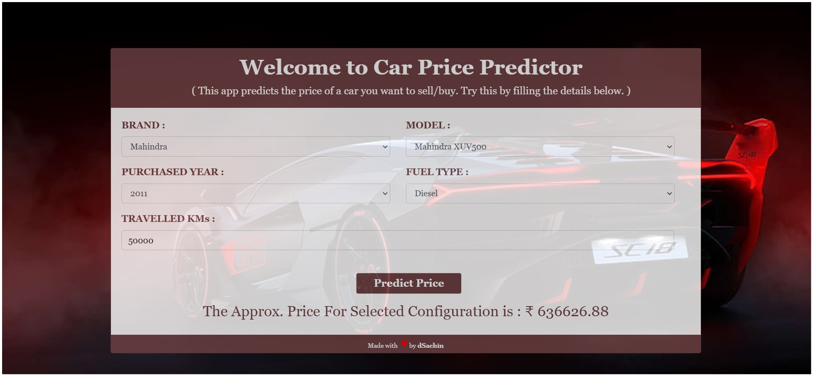

# Car-Price-Predictor
  In this project, we are going to implement a car price prediction of cars in machine learning. This model predicts the price of the old cars with the help of a few parameters like car brand, car model, fuel type, kilometer driven,etc.

# Project-Screen-shot

# Project Flow
1. Load the data
2. Analyze and visualize the dataset
3. Model training.
4. Model Evaluation.
5. Testing the model.
